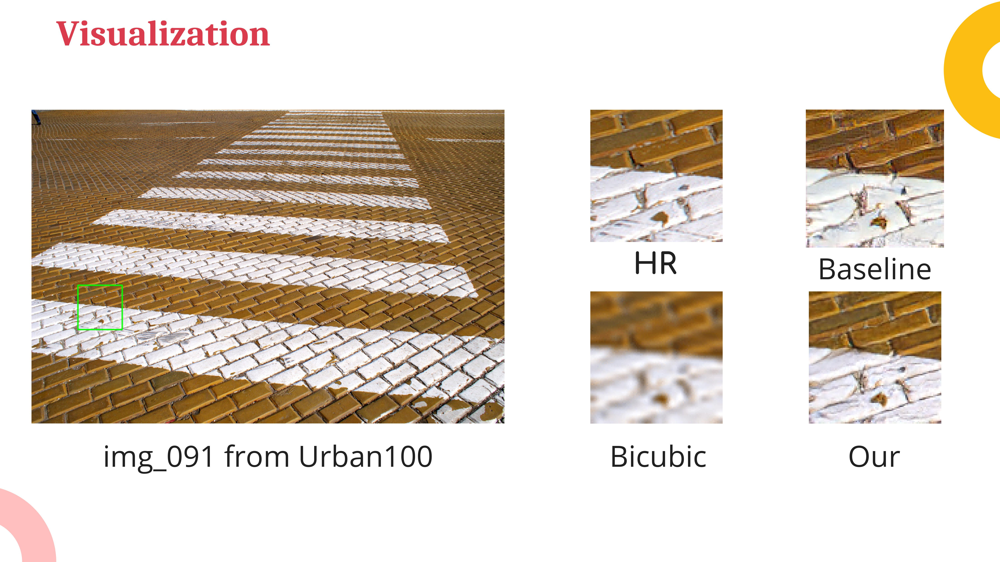
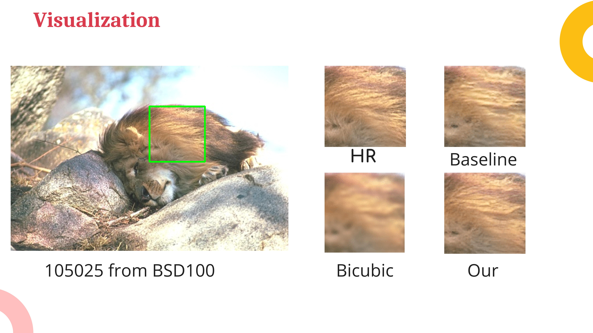
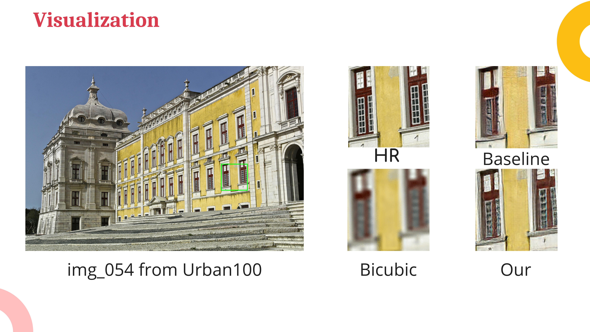

# thesis-bk
Repository for bachelor thesis in Ho Chi Minh University of Technology
## Members
1.  Truong Minh Duy - 1652113
2.  Nguyen Hoang Thuan - 1752054
## Notes
*  The report describes our teamwork, while the slide only presents my tasks.
   * Referring to my work in the report, please look at sections 2.1-2.4, 4.1, 5.2 and appendix A-C.
   * Shared writing with my teammate: Chapters 1, 3 and 6. 
*  As we lack experience at the working time, the code is not well-structured. 
   We will refactor it if we have a chance in the future.
## Sample images
* Some sample images from our model compared to the baseline and
  mathematic method (bicubic).
  
  
  

